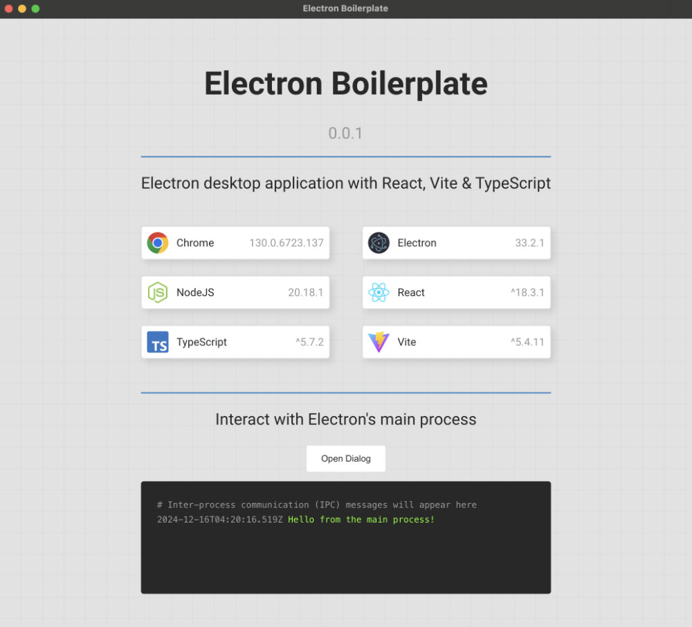

# Electron Boilerplate

A prebuilt project to help kickstart the creation of desktop apps using Electron, React, Vite & Typescript.

This boilerplate does not include a design system or component library. The goal is to keep this project as barebones as possible.



## Features

- 🌟 Electron
- 🔱 Vite
- 🌀 TypeScript
- ⚛️ React
- 🧹 ESLint + Prettier
- 📦 Electron Forge

## Installation

```bash
git clone https://github.com/jmcgavin/electron-vite-react-template
```

Install dependencies:

```bash
# pnpm
pnpm install

# or yarn
yarn install

# or npm
npm install
```

## Development

To develop and run your application, run following command:

```bash
pnpm start
```

### Linting

To lint the source code using ESLint, run the following command:

```bash
pnpm lint
```

To fix all auto-fixable linting issues, run the following command:

```bash
pnpm lint:fix
```

### Formatting

To check the source code for formatting issues using Prettier, run the following command:

```bash
pnpm format
```

To fix all auto-fixable formatting issues, run the following command:

```bash
pnpm format:fix
```

### Fix All

To fix all auto-fixable linting and formatting issues, run the following command:

```bash
pnpm fix:all
```

## Production

Use Electrong Forge to package and distibute your application.

### Package

Customize and package your Electron app with OS-specific bundles (.app, .exe etc)

```bash
pnpm package
```

### Make

Making is a way of taking your packaged application and making platform specific distributables like DMG, EXE, Flatpak files, etc.

```bash
pnpm make
```

### Publish

Publishing is a way of taking the artifacts generated by the `make` command and sending them to a service somewhere for you to distribute or use as updates. (This could be your update server or an S3 bucket)

```bash
pnpm publish
```

### Electron Forge Configuration

Provides an easy way of configuring your packaged application and making platform specific distributables like DMG, EXE, or Flatpak files.

The configuration file is available here:

```bash
forge.config.js
```

For further information visit [Electron Forge Configuration](https://www.electronforge.io/configuration).
